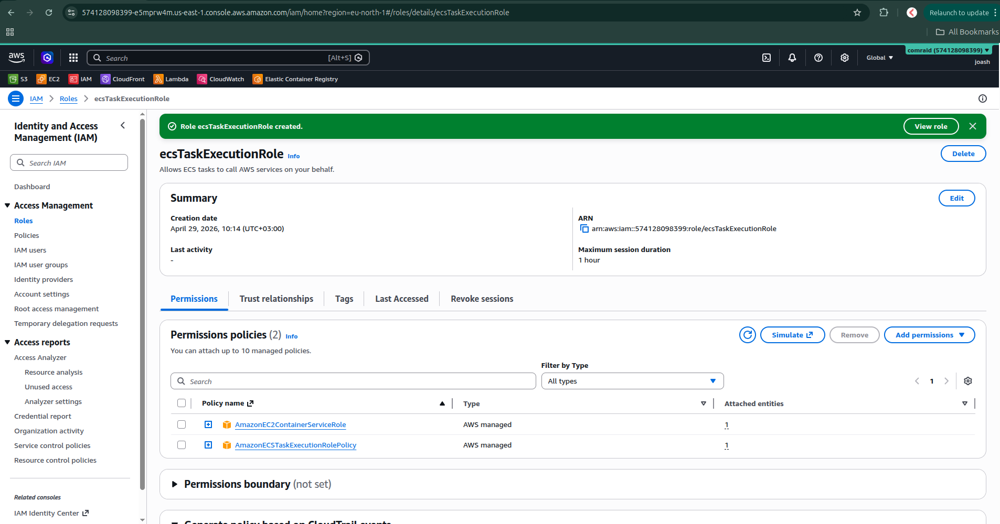
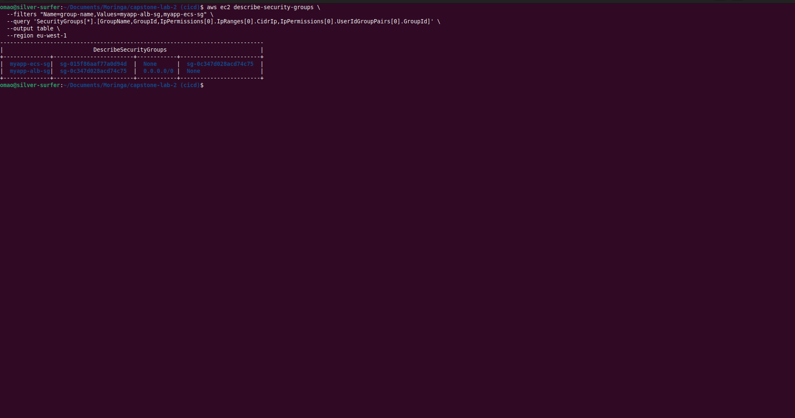
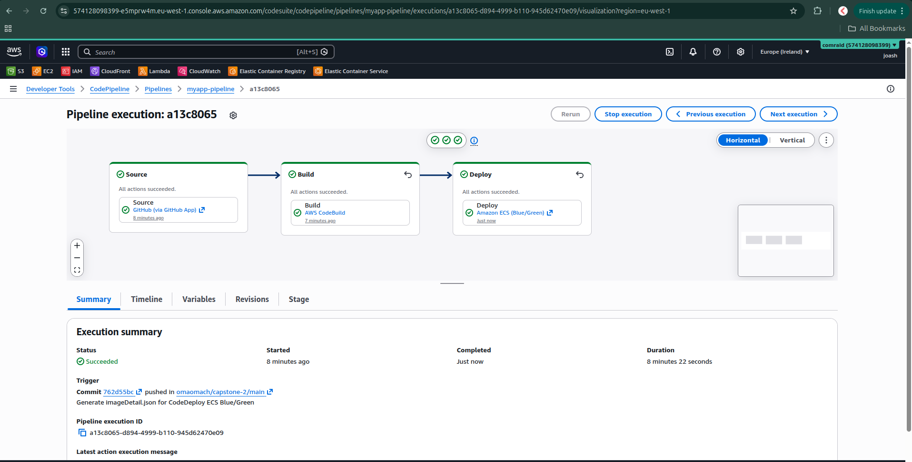
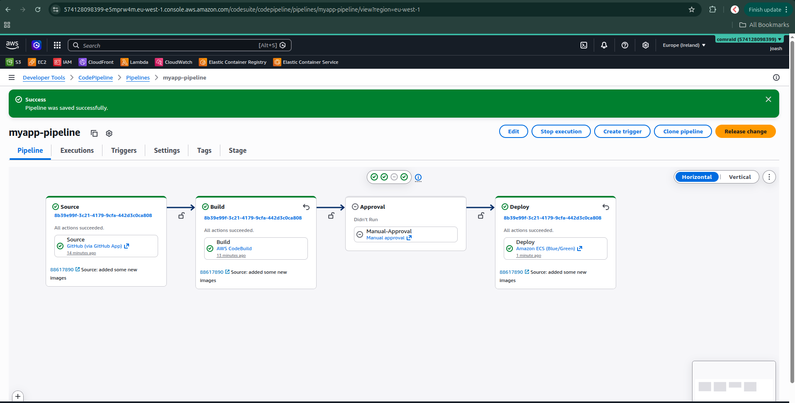

# Capstone Project: End-to-End CI/CD on AWS

**Author:** Omao
**Repository:** https://github.com/omaomach/capstone-2
**Region:** `eu-west-1` (Europe — Ireland)

## Project Overview

A fully automated CI/CD pipeline on AWS that takes code from GitHub, builds and tests it, packages it into a Docker container, and deploys it to an Amazon ECS cluster behind a load balancer. The project integrates CodePipeline, CodeBuild, CodeDeploy, and ECR, along with monitoring and a manual approval stage before production.

**Live URL:** http://myapp-alb-913856284.eu-west-1.elb.amazonaws.com

## Architecture

- **Source:** GitHub repository containing a Node.js Express application
- **Build:** AWS CodeBuild compiles the app, runs unit tests, and builds a Docker image
- **Artifact Storage:** Docker image is pushed to Amazon ECR
- **Deploy:** AWS CodeDeploy deploys the new container to Amazon ECS (Fargate) using Blue/Green
- **Orchestration:** AWS CodePipeline ties the stages together
- **Monitoring:** CloudWatch alarm monitors ECS service health
- **Approval:** A manual approval stage runs before the deployment stage

## Deliverables

This repository contains:

- `src/app.js` — Node.js Express web app
- `tests/app.test.js` — Jest unit tests
- `Dockerfile` — Container definition
- `buildspec.yml` — CodeBuild instructions (install dependencies, run tests, build and push Docker image, generate `imageDetail.json`)
- `appspec.yml` — CodeDeploy instructions for ECS Blue/Green
- `taskdef.json` — ECS Task Definition template
- `pipeline-diagram.png` — Final pipeline flow
- `docs/screenshots/` — Implementation evidence (26 screenshots)

The deployed system features:

- **AWS CodePipeline** with stages: Source (GitHub) → Build (CodeBuild) → Approval (manual) → Deploy (CodeDeploy → ECS)
- A **live ECS service** behind an Application Load Balancer
- Blue/Green deployments with auto-rollback on alarm
- CloudWatch + SNS email alerts on ECS service health

---

## Step-by-Step Guide

### Step 1: Prepare the Application Code

Created a simple Node.js Express app responding with `Hello from AWS CI/CD Capstone Project!` on port 3000. Containerized it with a Dockerfile and added Jest unit tests.

Verified locally:

```bash
npm install
npm test
docker build -t myapp:latest .
docker run -d -p 3000:3000 --name myapp myapp:latest
curl http://localhost:3000
```


### Step 2: Set Up ECR

Created a private ECR repository named `myapp-repo` in `eu-west-1` and pushed the locally built image:

```bash
aws ecr get-login-password --region eu-west-1 | \
  docker login --username AWS --password-stdin 574128098399.dkr.ecr.eu-west-1.amazonaws.com
docker tag myapp:latest 574128098399.dkr.ecr.eu-west-1.amazonaws.com/myapp-repo:latest
docker push 574128098399.dkr.ecr.eu-west-1.amazonaws.com/myapp-repo:latest
```

**Repository URI:** `574128098399.dkr.ecr.eu-west-1.amazonaws.com/myapp-repo`


### Step 3: Create ECS Cluster and Service

Created the ECS Fargate cluster, task definition, security groups, target groups, ALB, and service.

**IAM Role:** `ecsTaskExecutionRole` with `AmazonECSTaskExecutionRolePolicy` and an inline `AllowCreateLogGroup` policy (the latter required to allow `awslogs-create-group: true` in the task definition).



**Task Definition:** `myapp-task` registered with the `<IMAGE>` placeholder for CodeDeploy substitution and a `logConfiguration` block routing container logs to CloudWatch.


**Security Groups:**

- `myapp-alb-sg` — allows ports 80 and 8080 from `0.0.0.0/0`
- `myapp-ecs-sg` — allows port 3000 only from `myapp-alb-sg`



**Target Groups (Blue/Green):** `myapp-tg-blue` and `myapp-tg-green`, both target type `IP` (required for Fargate `awsvpc` mode), HTTP/3000.


**Application Load Balancer (`myapp-alb`):** Internet-facing across all 3 AZs in eu-west-1, with two listeners required for Blue/Green:

- Port 80 (production) → `myapp-tg-blue`
- Port 8080 (test) → `myapp-tg-green`


**ECS Cluster (`myapp-cluster`):** Fargate-only, with Container Insights with enhanced observability enabled.


**ECS Service (`myapp-service`):** Created via CLI with `deploymentController.type: CODE_DEPLOY` (required for the Blue/Green deployment type specified in the lab):

```bash
aws ecs create-service --cli-input-json file://service-definition.json --region eu-west-1
```

The service launched a Fargate task that registered into the blue target group, with the ALB serving traffic on port 80.


### Step 4: Configure CodeBuild

Created `myapp-build` connected to the GitHub repo via AWS CodeStar Connections. Privileged mode enabled to allow Docker-in-Docker builds.

The `buildspec.yml` defines the steps:

1. Log in to ECR
2. Install dependencies (`npm install`)
3. Run unit tests (`npm test`)
4. Build the Docker image
5. Push it to ECR (with both commit-hash tag and `:latest`)
6. Generate `imageDetail.json` for CodeDeploy

The auto-generated CodeBuild service role was augmented with an inline `AllowECRPush` policy granting the ECR write actions scoped to `myapp-repo`.


### Step 5: Configure CodeDeploy

**Service Role (`AWSCodeDeployRoleForECS`):** Created with the AWS-managed policy `AWSCodeDeployRoleForECS`.


**Application (`myapp-codedeploy`):** Compute platform ECS.


**Deployment Group (`myapp-deployment-group`):** Created via CLI with full Blue/Green configuration:

- Deployment type: `BLUE_GREEN` with traffic control
- Deployment configuration: `CodeDeployDefault.ECSAllAtOnce`
- 5-minute bake time before terminating old tasks
- Auto-rollback on `DEPLOYMENT_FAILURE` and `DEPLOYMENT_STOP_ON_ALARM`
- Wired to `myapp-tg-blue` / `myapp-tg-green` and the production (80) and test (8080) listeners

The `appspec.yml` and `taskdef.json` files (deliverables in this repo) define the ECS deployment for CodeDeploy.


### Step 6: Create CodePipeline

Created `myapp-pipeline` chaining four stages:

| Stage                                   | Provider                | Configuration                                                                                                      |
| --------------------------------------- | ----------------------- | ------------------------------------------------------------------------------------------------------------------ |
| Source (GitHub)                         | GitHub via GitHub App   | `omaomach/capstone-2` on `main`, push trigger                                                                      |
| Build (CodeBuild → build + Docker push) | AWS CodeBuild           | Project `myapp-build`                                                                                              |
| Approval (manual before production)     | Manual approval         | Pauses for human review                                                                                            |
| Deploy (CodeDeploy → ECS)               | Amazon ECS (Blue/Green) | App `myapp-codedeploy`, group `myapp-deployment-group`, `<IMAGE>` placeholder substitution from `imageDetail.json` |

The pipeline triggers on every push to `main`. After Build completes, it pauses at the Approval stage for manual review, then proceeds to Deploy.






### Step 7: Add Monitoring

**SNS Topic (`myapp-alerts`):** Created with an email subscription to `omao@comraid.io`. The subscription was confirmed via the AWS confirmation link.

```bash
aws sns create-topic --name myapp-alerts --region eu-west-1
aws sns subscribe --topic-arn arn:aws:sns:eu-west-1:574128098399:myapp-alerts \
  --protocol email --notification-endpoint omao@comraid.io --region eu-west-1
```

**CloudWatch Alarm (`myapp-no-running-tasks`):** Monitors `RunningTaskCount` (from Container Insights) on the ECS service, firing when fewer than 1 task is running for 2 consecutive minutes. Alarm and OK transitions both notify the SNS topic.

```bash
aws cloudwatch put-metric-alarm \
  --alarm-name myapp-no-running-tasks \
  --metric-name RunningTaskCount \
  --namespace ECS/ContainerInsights \
  --statistic Average --period 60 --evaluation-periods 2 \
  --threshold 1 --comparison-operator LessThanThreshold \
  --treat-missing-data breaching \
  --dimensions Name=ClusterName,Value=myapp-cluster Name=ServiceName,Value=myapp-service \
  --alarm-actions arn:aws:sns:eu-west-1:574128098399:myapp-alerts \
  --ok-actions arn:aws:sns:eu-west-1:574128098399:myapp-alerts \
  --region eu-west-1
```

**Auto-Rollback Wiring:** The alarm is associated with the CodeDeploy deployment group, completing the loop — a failed deploy that leaves no running tasks fires the alarm, which triggers `DEPLOYMENT_STOP_ON_ALARM` rollback in CodeDeploy.

```bash
aws deploy update-deployment-group \
  --application-name myapp-codedeploy \
  --current-deployment-group-name myapp-deployment-group \
  --alarm-configuration enabled=true,alarms=[{name=myapp-no-running-tasks}] \
  --region eu-west-1
```

**Verification:** The alarm was tested by setting the ECS service `desiredCount` to 0. The state transitioned `OK → ALARM` after 2 minutes, an email was delivered, and the alarm transitioned back to `OK` after the service was restored.


---

## Pipeline Flow Diagram


---

## Repository Structure

```
capstone-2/
├── README.md
├── pipeline-diagram.png
├── Dockerfile
├── package.json
├── package-lock.json
├── buildspec.yml
├── appspec.yml
├── taskdef.json
├── .dockerignore
├── .gitignore
├── src/
│   └── app.js
├── tests/
│   └── app.test.js
└── docs/
    └── screenshots/
        ├── 01-tests-passing.png
        ├── ...
        └── 26-cloudwatch-alarm-email.png
```
